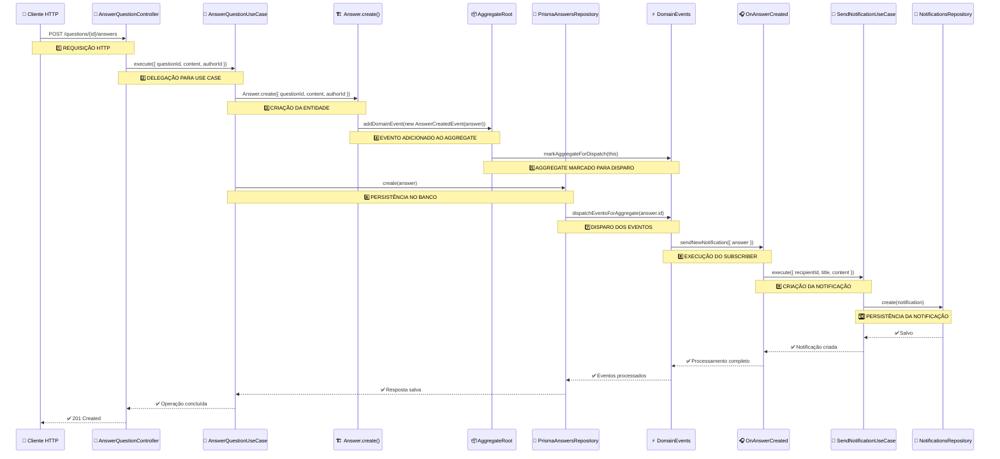

# 📊 Diagrama Completo do Fluxo de Eventos - Criação de Resposta

## 🔄 **FLUXO PRINCIPAL: Da Requisição HTTP até a Notificação**



---

## 🎯 **FLUXO DETALHADO: Criação e Envio do Evento**

```
📝 FASE 1: CRIAÇÃO DA RESPOSTA E EVENTO
┌─────────────────────────────────────────────────────────────┐
│ 1. 🌐 Requisição HTTP                                        │
│    POST /questions/{questionId}/answers                     │
│    Body: { content: "...", attachments: [] }               │
└─────────────────────────────────────────────────────────────┘
                              ▼
┌─────────────────────────────────────────────────────────────┐
│ 2. 🎯 AnswerQuestionController.handle()                     │
│    - Extrai dados da requisição                            │
│    - Chama o use case                                       │
└─────────────────────────────────────────────────────────────┘
                              ▼
┌─────────────────────────────────────────────────────────────┐
│ 3. 💼 AnswerQuestionUseCase.execute()                       │
│    - Valida dados de entrada                               │
│    - Cria a entidade Answer                                 │
│    - Salva no repositório                                   │
└─────────────────────────────────────────────────────────────┘
                              ▼
┌─────────────────────────────────────────────────────────────┐
│ 4. 🏗️ Answer.create() - CRIAÇÃO DO EVENTO                   │
│    ```typescript                                           │
│    static create(props, id?) {                             │
│      const answer = new Answer(props, id)                  │
│      const isNewAnswer = !id                               │
│                                                             │
│      if (isNewAnswer) {                                     │
│        answer.addDomainEvent(                               │
│          new AnswerCreatedEvent(answer) // 🔥 EVENTO!      │
│        )                                                    │
│      }                                                      │
│      return answer                                          │
│    }                                                        │
│    ```                                                      │
└─────────────────────────────────────────────────────────────┘
                              ▼
┌─────────────────────────────────────────────────────────────┐
│ 5. 📦 AggregateRoot.addDomainEvent()                        │
│    ```typescript                                           │
│    protected addDomainEvent(domainEvent: DomainEvent) {    │
│      this._domainEvents.push(domainEvent)                  │
│      DomainEvents.markAggregateForDispatch(this) // 📝     │
│    }                                                        │
│    ```                                                      │
└─────────────────────────────────────────────────────────────┘
                              ▼
┌─────────────────────────────────────────────────────────────┐
│ 6. 💾 PrismaAnswersRepository.create()                      │
│    - Salva a resposta no banco de dados                    │
│    - Salva os anexos                                        │
│    - DISPARA OS EVENTOS: dispatchEventsForAggregate()      │
└─────────────────────────────────────────────────────────────┘
```

---

## ⚡ **FLUXO DETALHADO: Processamento do Evento**

```
🎧 FASE 2: PROCESSAMENTO DO EVENTO PELO SUBSCRIBER
┌─────────────────────────────────────────────────────────────┐
│ 7. ⚡ DomainEvents.dispatchEventsForAggregate()             │
│    ```typescript                                           │
│    public static dispatchEventsForAggregate(id) {          │
│      const aggregate = this.findMarkedAggregateByID(id)    │
│      if (aggregate) {                                       │
│        this.dispatchAggregateEvents(aggregate) // 🚀       │
│        aggregate.clearEvents()                              │
│      }                                                      │
│    }                                                        │
│    ```                                                      │
└─────────────────────────────────────────────────────────────┘
                              ▼
┌─────────────────────────────────────────────────────────────┐
│ 8. 📢 DomainEvents.dispatch()                               │
│    ```typescript                                           │
│    private static dispatch(event: DomainEvent) {           │
│      const eventClassName = event.constructor.name         │
│      // "AnswerCreatedEvent"                               │
│                                                             │
│      if (eventClassName in this.handlersMap) {             │
│        const handlers = this.handlersMap[eventClassName]   │
│        for (const handler of handlers) {                   │
│          handler(event) // 🎯 CHAMA O SUBSCRIBER!          │
│        }                                                    │
│      }                                                      │
│    }                                                        │
│    ```                                                      │
└─────────────────────────────────────────────────────────────┘
                              ▼
┌─────────────────────────────────────────────────────────────┐
│ 9. 🎧 OnAnswerCreated.sendNewNotification()                 │
│    ```typescript                                           │
│    private async sendNewNotification({ answer }) {         │
│      // 🔍 Busca a pergunta                                │
│      const question = await this.questionsRepository       │
│        .findById(answer.questionId.toString())             │
│                                                             │
│      if (question) {                                       │
│        // 📧 Envia notificação para o autor da pergunta    │
│        await this.sendNotification.execute({               │
│          recipientId: question.authorId.toString(),        │
│          content: `Nova resposta em "${question.title}"`,  │
│          title: question.excerpt                           │
│        })                                                   │
│      }                                                      │
│    }                                                        │
│    ```                                                      │
└─────────────────────────────────────────────────────────────┘
                              ▼
┌─────────────────────────────────────────────────────────────┐
│ 10. 📧 SendNotificationUseCase.execute()                   │
│     - Cria uma nova notificação                            │
│     - Salva no repositório de notificações                 │
│     - Retorna sucesso                                       │
└─────────────────────────────────────────────────────────────┘
```

---

## 🕐 **TIMELINE: Quando Cada Parte Executa**

```
INICIALIZAÇÃO DA APLICAÇÃO (npm run start:dev):
🚀 00:00:00.000 - NestJS carrega AppModule
🚀 00:00:00.100 - NestJS carrega EventsModule  
🚀 00:00:00.150 - NestJS instancia OnAnswerCreated
🏗️ 00:00:00.151 - OnAnswerCreated.constructor() executado
⚙️ 00:00:00.152 - setupSubscriptions() executado
📝 00:00:00.153 - DomainEvents.register() executado
✅ 00:00:00.154 - Subscriber registrado para "AnswerCreatedEvent"

DURANTE UMA REQUISIÇÃO (POST /questions/{id}/answers):
🌐 00:01:23.000 - Cliente envia requisição HTTP
🎯 00:01:23.005 - AnswerQuestionController.handle()
💼 00:01:23.010 - AnswerQuestionUseCase.execute()
🏗️ 00:01:23.015 - Answer.create() ➜ AnswerCreatedEvent criado
📦 00:01:23.016 - addDomainEvent() ➜ evento adicionado ao aggregate
💾 00:01:23.050 - PrismaAnswersRepository.create() ➜ salva no banco
⚡ 00:01:23.060 - DomainEvents.dispatchEventsForAggregate()
📢 00:01:23.061 - DomainEvents.dispatch()
🎧 00:01:23.062 - OnAnswerCreated.sendNewNotification() EXECUTA!
🔍 00:01:23.065 - Busca pergunta no repositório
📧 00:01:23.070 - SendNotificationUseCase.execute()
💾 00:01:23.075 - Salva notificação no banco
✅ 00:01:23.080 - Retorna 201 Created ao cliente
```

---

## 🎯 **PONTOS-CHAVE PARA IDENTIFICAR EXECUÇÃO:**

### 📍 **Onde identificar que o subscriber executou:**

1. **🏗️ Log no construtor:** Quando a aplicação inicia
2. **🎧 Log no sendNewNotification:** Quando o evento é processado
3. **📧 Log no SendNotificationUseCase:** Quando a notificação é criada
4. **💾 Log no banco:** Nova linha na tabela `notifications`

### 🔍 **Logs que confirmam execução:**

```
✅ OnAnswerCreated.setupSubscriptions: Subscriber registrado com sucesso!
🎯 OnAnswerCreated.sendNewNotification: MÉTODO EXECUTADO!
📧 SendNotificationUseCase: INICIANDO criação de notificação
✅ SendNotificationUseCase: Notificação criada e salva com sucesso!
```

---

## ⚠️ **Possíveis Problemas e Soluções:**

| Problema | Como Identificar | Solução |
|----------|------------------|---------|
| Subscriber não registrado | Não aparece log de `setupSubscriptions` | Verificar se está no `EventsModule.providers` |
| Evento não dispara | Repositório não chama `dispatchEventsForAggregate` | Verificar implementação do repositório |
| Handler não executa | Evento dispara mas subscriber não executa | Verificar se `DomainEvents.shouldRun = true` |
| Pergunta não encontrada | Log `❌ Pergunta não encontrada` | Verificar se a pergunta existe no banco |

---

**🎉 Este diagrama mostra todo o fluxo desde a requisição HTTP até a criação da notificação!**
